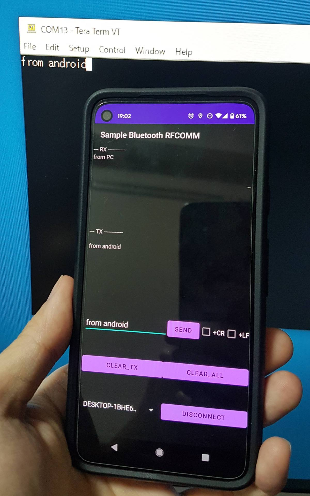
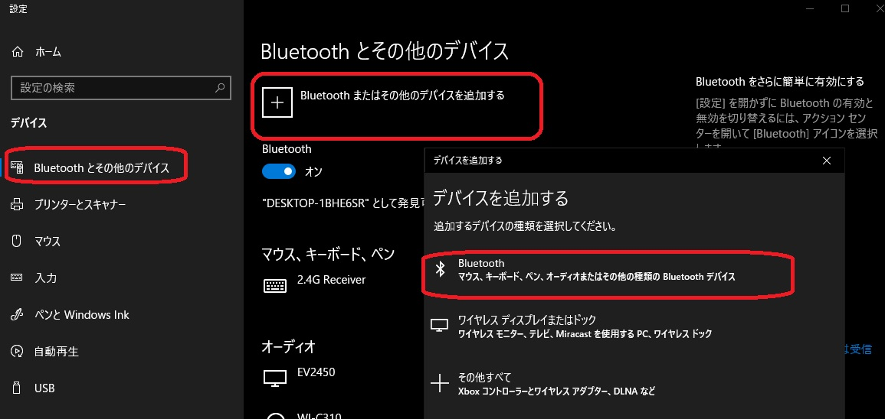
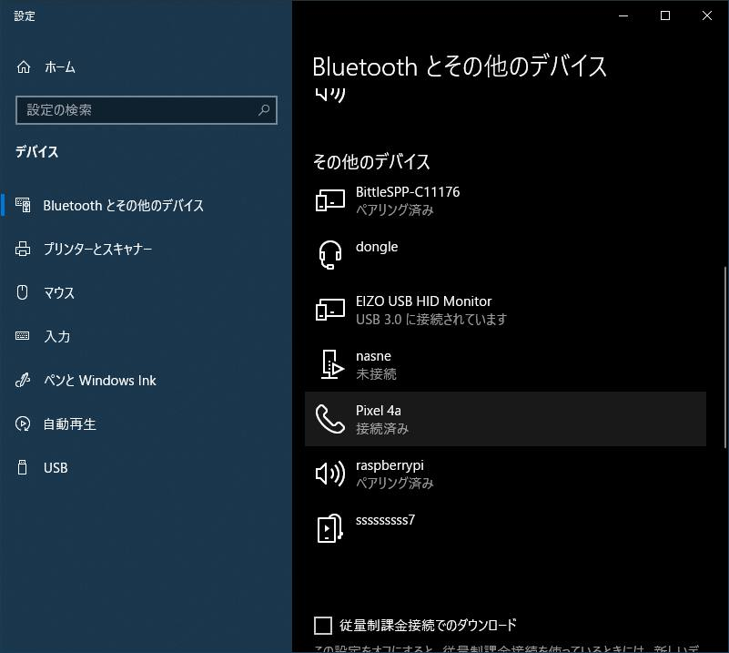
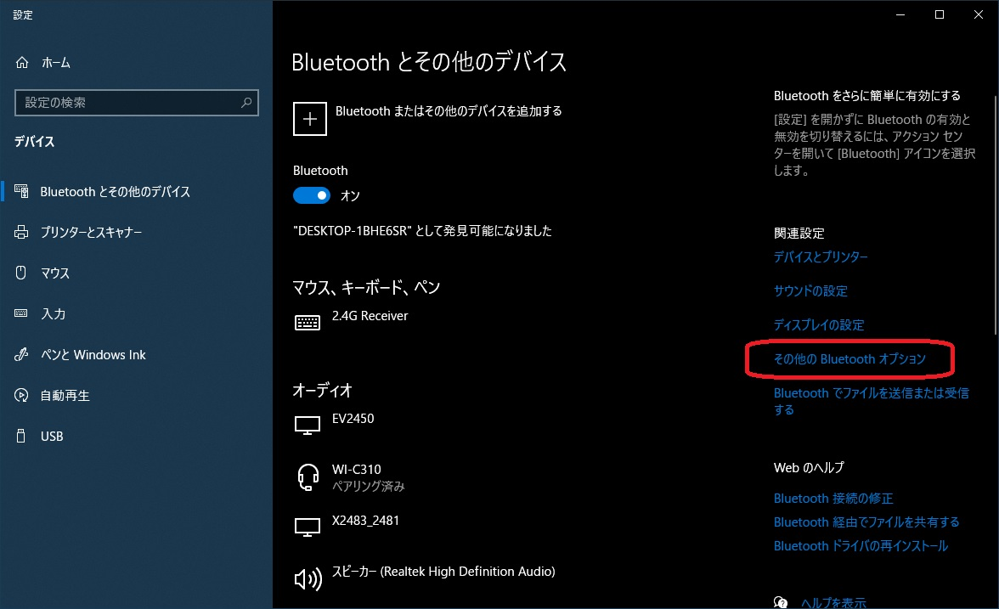
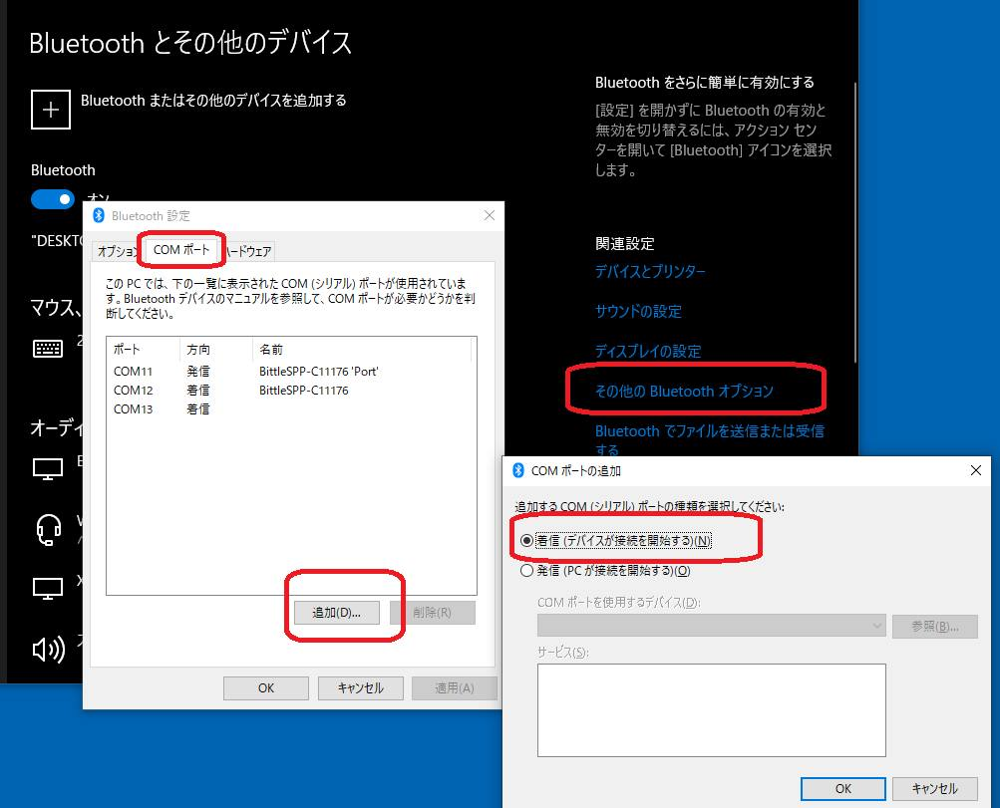
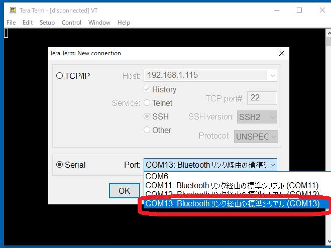

# Sample project for Bluetooth Serial Port Profile (SPP) with RFCOMM on Android

## How to use
1. On PC, add a new Bluetooth COM port (see below)
2. On PC and Android, do paring
	- The created icon on PC may look "Phone", but you can use it as SPP
3. On PC, start terminal app like TeraTerm, and connect to the created COM port
4. On Android, start this app, select the PC and connect

### How to add a new Bluetooth COM port in Windows 10
- 
- 
- 
- 
- 

## Acknowledgements
https://qiita.com/aoirint/items/d2cebec7a9e8c3680780
